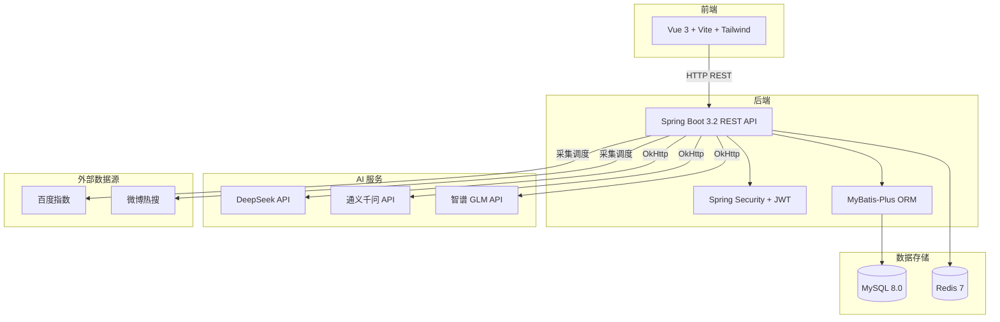

# MarketAI

AI 驱动的市场需求分析平台，面向创业者和企业产品/市场团队。

MarketAI 利用大语言模型（LLM）对市场趋势、用户需求、竞品格局进行多维度结构化分析，帮助团队快速验证产品想法、发现市场机会、制定差异化策略。平台支持 DeepSeek、通义千问、智谱 GLM 等多种 AI 服务商切换，覆盖数据采集 → AI 分析 → 可视化决策的完整工作流。

## 架构概览



## 技术栈

| 层级 | 技术 | 版本 |
|------|------|------|
| 前端框架 | Vue 3 (Composition API) + TypeScript | 3.4+ |
| 构建工具 | Vite | 5.1+ |
| CSS 框架 | Tailwind CSS | 3.4+ |
| 状态管理 | Pinia | 2.1+ |
| 图表库 | ECharts + vue-echarts | 5.5+ |
| 后端框架 | Spring Boot | 3.2.3 |
| Java 版本 | JDK 21 | 21 |
| ORM | MyBatis-Plus | 3.5.5 |
| 认证 | Spring Security + JWT (jjwt) | 0.12.5 |
| 工具库 | Hutool | 5.8.27 |
| HTTP 客户端 | OkHttp | 4.12 |
| 数据库 | MySQL | 8.0 |
| 缓存 | Redis | 7 (Alpine) |
| AI 默认 | DeepSeek API | deepseek-chat |
| AI 可选 | 通义千问 / 智谱 GLM | qwen-plus / glm-4-plus |
| 部署 | Docker + Docker Compose | — |
| API 文档 | SpringDoc OpenAPI | 2.3.0 |

## 项目结构

```
marketai/
├── frontend/                    # Vue 3 前端
│   ├── src/
│   │   ├── api/                 # API 请求封装 (axios)
│   │   ├── assets/              # 静态资源
│   │   ├── components/          # 通用组件
│   │   ├── composables/         # 组合式函数
│   │   ├── layouts/             # 布局组件
│   │   ├── router/              # 路由配置
│   │   ├── stores/              # Pinia 状态管理
│   │   ├── types/               # TypeScript 类型定义
│   │   ├── utils/               # 工具函数
│   │   └── views/               # 页面组件
│   ├── Dockerfile               # 生产构建 (多阶段, nginx)
│   └── nginx.conf               # SPA 路由 + API 反向代理
├── backend/                     # Spring Boot 后端
│   ├── src/main/java/com/marketai/backend/
│   │   ├── ai/                  # AI 模型调用封装 (LLM/洞察/画像/竞品)
│   │   ├── common/              # 通用类 (Result, BusinessException, Constants)
│   │   ├── config/              # 配置类 (Security, CORS, OpenAPI, Redis, MyBatis)
│   │   ├── controller/          # REST 控制器
│   │   ├── dto/                 # 请求 DTO
│   │   ├── entity/              # 数据库实体
│   │   ├── mapper/              # MyBatis Mapper 接口
│   │   ├── security/            # JWT 认证过滤器
│   │   ├── service/             # 业务逻辑层
│   │   └── vo/                  # 响应 VO
│   ├── Dockerfile               # 生产构建 (多阶段, JRE Alpine)
│   └── pom.xml
├── docker/                      # Docker 部署配置
│   ├── docker-compose.yml       # 生产配置 (mysql + redis + backend + frontend)
│   ├── docker-compose.dev.yml   # 开发配置 (仅 mysql + redis)
│   ├── .env.example             # 环境变量模板
│   └── mysql/init/              # 数据库初始化脚本
└── docs/                        # 开发文档
    ├── 01-architecture.md
    ├── 02-database-schema.md
    ├── 03-api-design.md
    ├── 04-ai-prompt-engineering.md
    ├── 05-deployment.md
    └── 06-troubleshooting.md
```

## 本地开发

### 前置依赖

- **Java 21+** (`java -version`)
- **Node.js 20+** (`node -v`)
- **Maven 3.9+** (`mvn --version`)
- **Docker Desktop** (提供 MySQL 和 Redis)

### 启动步骤

```bash
# 1. 克隆项目
git clone <your-repo-url>
cd MarketAI

# 2. 配置环境变量
cp docker/.env.example docker/.env
# 编辑 docker/.env, 至少填写 DEEPSEEK_API_KEY

# 3. 启动基础设施 (MySQL + Redis)
docker compose -f docker/docker-compose.dev.yml up -d

# 4. 启动后端 (新终端)
cd backend
mvn spring-boot:run
# 启动后访问: http://localhost:8080
# Swagger 文档: http://localhost:8080/swagger-ui.html
# 健康检查: http://localhost:8080/actuator/health

# 5. 启动前端 (新终端)
cd frontend
npm install
npm run dev
# 访问: http://localhost:5173
```

### 默认账户

注册 API (`POST /api/v1/auth/register`) 可用于创建新账户，详见 [Swagger 文档](http://localhost:8080/swagger-ui.html)。

## 主要功能

| 模块 | 说明 | 入口 |
|------|------|------|
| 市场趋势仪表盘 | 搜索热度、社媒讨论、情感分析、异常检测 | `/dashboard/:projectId` |
| AI 需求洞察 | 多维度结构化市场分析报告 (异步生成) | `/insights` |
| AI 用户画像 | 自动生成目标用户画像, 包含决策参数 | `/personas` |
| 竞品分析 | 功能矩阵对比 + 差异化建议 | `/competitors` |
| 数据采集 | 多数据源趋势数据自动采集 | `/datasource` |
| 项目管理 | 创建/配置/归档分析项目 | `/projects` |

## 功能演示

> 以下为功能界面截图占位，Phase 2 开发完成后替换为实际截图。

| 仪表盘首页 | AI 需求洞察 | 竞品分析 |
|:---:|:---:|:---:|
|  |  |  |

| 用户画像 | 项目管理 | Swagger 文档 |
|:---:|:---:|:---:|
|  |  |  |

## API 文档

启动后端后访问:
- **Swagger UI**: http://localhost:8080/swagger-ui.html
- **OpenAPI JSON**: http://localhost:8080/v3/api-docs

所有 API 路径前缀: `/api/v1`

统一响应格式:

```json
{
  "code": 200,
  "message": "success",
  "data": {}
}
```

错误码详见 [API 设计文档](docs/03-api-design.md)。

## 环境变量

| 变量 | 说明 | 必填 | 示例 |
|------|------|------|------|
| `MYSQL_ROOT_PASSWORD` | MySQL root 密码 | 是 | `my-secure-pwd` |
| `REDIS_PASSWORD` | Redis 密码 | 否 | `redis-pwd` |
| `JWT_SECRET` | JWT 签名密钥 (≥32 字符) | 是 | `随机字符串` |
| `DEEPSEEK_API_KEY` | DeepSeek API Key | 是 | `sk-xxx` |
| `QWEN_API_KEY` | 通义千问 API Key | 否 | `sk-xxx` |
| `GLM_API_KEY` | 智谱 GLM API Key | 否 | `xxx` |
| `AI_PROVIDER` | 默认 AI 服务商 | 否 | `deepseek` |

## 部署

```bash
# 1. 配置生产环境变量
cp docker/.env.example docker/.env
vim docker/.env   # 修改所有密码和 API Key

# 2. 构建并启动全部服务
docker compose -f docker/docker-compose.yml up -d

# 3. 验证
curl http://localhost:8080/actuator/health
curl http://localhost:80/
```

详见 [部署文档](docs/05-deployment.md)。

## 端口约定

| 服务 | 端口 |
|------|------|
| 前端 (Nginx) | 80 |
| 后端 (Spring Boot) | 8080 |
| MySQL | 3306 |
| Redis | 6379 |

## 贡献指南

1. Fork 本项目
2. 创建功能分支: `git checkout -b feat/your-feature`
3. 遵循代码规范:
   - 前端: ESLint + Prettier, 组件 PascalCase, 文件 kebab-case
   - 后端: 阿里巴巴 Java 开发规范, 关键业务逻辑必须有中文注释
4. 确保代码通过检查: `npm run lint` (前端) / `mvn verify` (后端)
5. 提交前 rebase 到 main 分支, 保持线性历史
6. 提交 Pull Request, 描述清楚改了什么、为什么这样改

## 许可证

MIT License