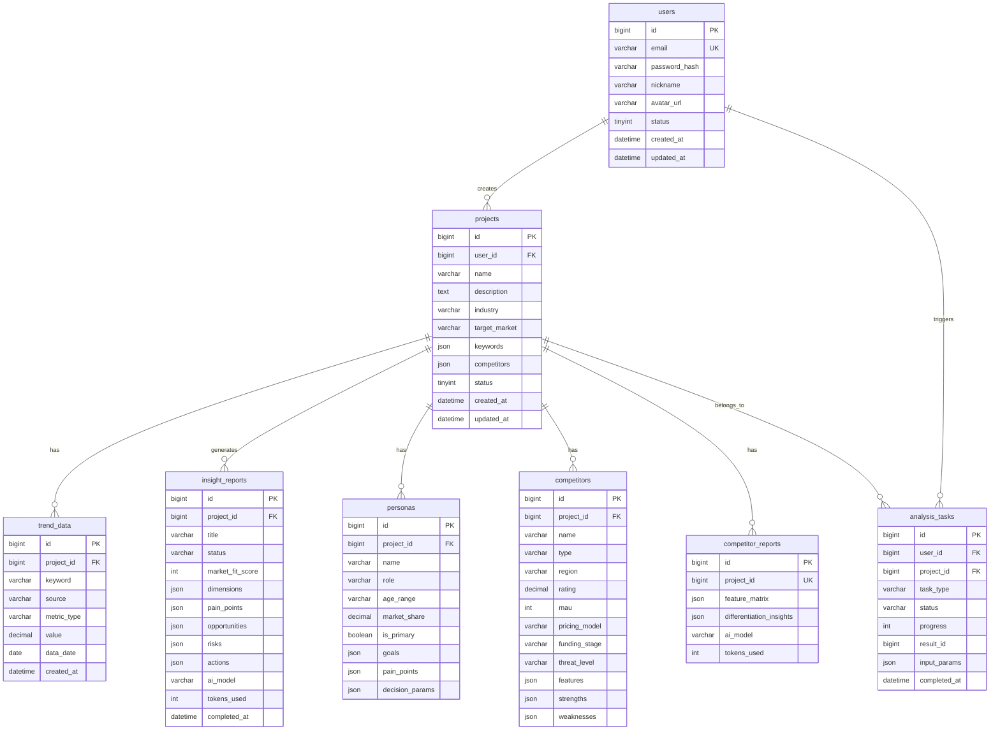

# 02 — 数据库 Schema 设计

> 状态: Phase 1 骨架 | 最后更新: 2026-05-14

## ER 图

## 表汇总

| 表名 | 行数预期 | 核心用途 |
|------|----------|---------|
| `users` | ~10K | 用户注册与认证 |
| `projects` | ~50K | 分析项目配置 |
| `trend_data` | ~10M | 市场趋势时序数据 (最大表) |
| `insight_reports` | ~500K | AI 生成的洞察报告 |
| `personas` | ~250K | 用户画像 (每项目 3-5 个) |
| `competitors` | ~200K | 竞品详情 |
| `competitor_reports` | ~50K | 项目级竞品聚合分析 |
| `analysis_tasks` | ~500K | 异步任务追踪 |

## 关键索引策略

| 表 | 索引 | 场景 |
|----|------|------|
| `trend_data` | `uk_trend_data` (五元组唯一) | 幂等写入, INSERT IGNORE |
| `trend_data` | `idx_trend_project_source_metric_date` | 仪表盘聚合查询 |
| `projects` | `idx_user_id` + `idx_status` | 用户项目列表筛选 |
| `analysis_tasks` | `idx_task_type_status` | 轮询 pending 任务 |
| `insight_reports` | `idx_project_id` + `idx_status` | 项目报告列表 |

## JSON 列说明

Phase 1 使用 MySQL JSON 类型存储动态结构:

- `projects.keywords` — `["关键词1", "关键词2"]`
- `projects.competitors` — `["竞品1", "竞品2"]`
- `insight_reports.dimensions` — `{"demand_strength": 85, ...}`
- `insight_reports.pain_points` — `[{"title":"...", "severity":"high", "desc":"..."}]`
- `competitors.features` — `{"feature_a": "yes", "feature_b": "partial"}`
- `personas.decision_params` — `{"payment_willingness": "high", ...}`

**注意**: 使用 MyBatis-Plus 的 `JacksonTypeHandler` 序列化 JSON 列时, Mapper 必须配置 `@TableName(autoResultMap = true)` + `@TableField(typeHandler = JacksonTypeHandler.class)`, 否则 SELECT 查询中 JSON 字段返回 null。

详见: `backend/src/main/resources/db/init.sql` (完整建表语句)